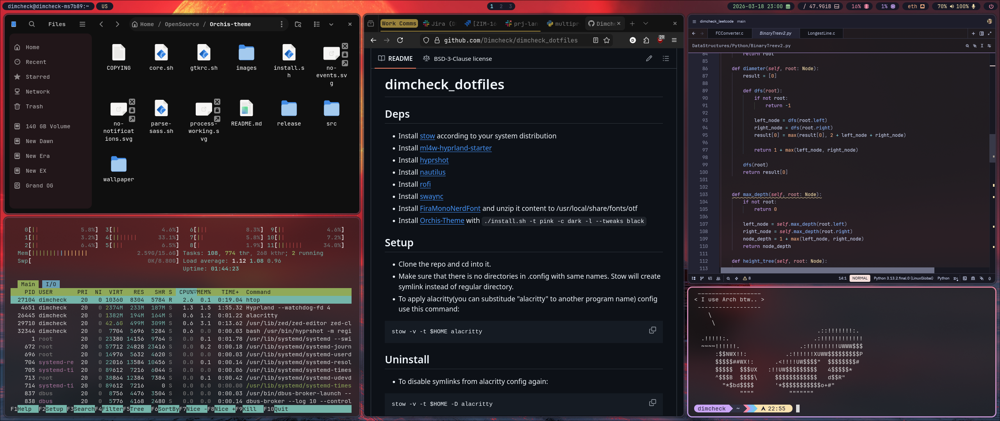

# dimcheck_dotfiles

## Deps
- Install [stow](https://www.gnu.org/software/stow/) according to your system distribution
- Install [ml4w-hyprland-starter](https://github.com/mylinuxforwork/hyprland-starter)
- Install [hyprshot](https://aur.archlinux.org/packages/hyprshot)
- Install [nautilus](https://archlinux.org/packages/extra/x86_64/nautilus/)
- Install [rofi](https://github.com/davatorium/rofi)
- Install [swaync](https://archlinux.org/packages/extra/x86_64/swaync/)
- Install [FiraMonoNerdFont](https://github.com/ryanoasis/nerd-fonts/releases/download/v3.3.0/FiraMono.zip) and unzip it content to /usr/local/share/fonts/otf
- Install [Orchis-Theme](https://github.com/vinceliuice/Orchis-theme)

## Setup
- Clone the repo and cd into it.
- Make sure that there is no directories in .config with same names. Stow will create symlink instead of regular directory.
- To apply alacritty(you can substitude "alacritty" to another program name) config use this command:
 ```bash
 stow -v -t $HOME alacritty
 ```

## Uninstall
- To disable symlinks from alacritty config again:
 ```bash
 stow -v -t $HOME -D alacritty
 ```

## Result
Enjoy the final look✨:



## Notes
- To set custom fonts to GTK based apps use this command:
```bash
gsettings set org.gnome.desktop.interface font-name 'JetBrains Mono 11'

```
- To list available fonts:
```bash
fc-list | grep fontname
```
